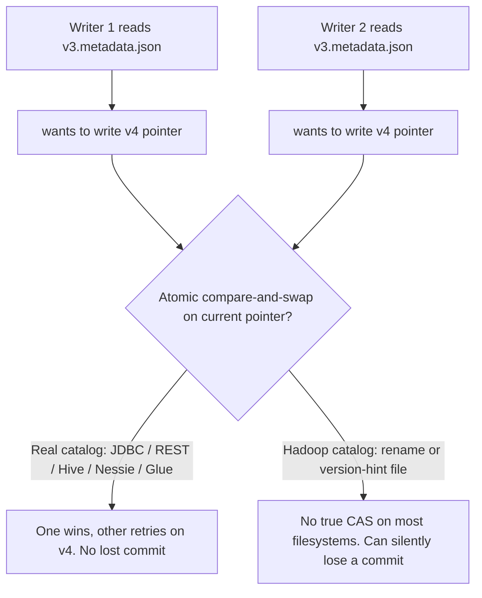
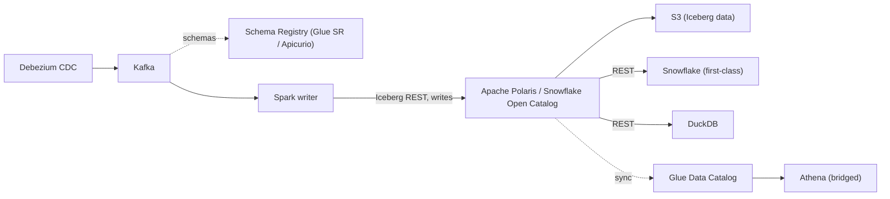

# Iceberg Catalog & Schema Registry Options

Analysis of catalog choices for the `open_tables_writer` project, covering concurrency
safety, schema registry, and multi-engine querying (Snowflake, Athena, DuckDB).

## Context

- The pipeline is Debezium CDC -> Kafka -> Spark writer -> Iceberg tables.
- Today both `local_catalog` and `silver_catalog` use the Iceberg **Hadoop catalog**
  (`type = hadoop`), configured in
  [`SparkSessionFactory.java`](src/main/java/com/thealtered7/SparkSessionFactory.java).
- Delta support is likely being removed, so decisions can be optimized purely for Iceberg.
- Deployment: AWS shop. Glue is acceptable, but open-source options are of interest.
- Query engines wanted: **Snowflake (priority)**, Athena (nice-to-have), DuckDB.
- The Spark job is effectively the **sole writer**; Athena/DuckDB/Snowflake are readers.

## Key framing: two different layers

A "schema registry" and an "Iceberg catalog" solve different problems. Conflating them
causes trouble.

- **Schema registry** (Confluent, Apicurio, Glue Schema Registry): governs the wire format
  of the raw Kafka/Debezium messages (Avro/Protobuf/JSON schemas and compatibility). Lives
  at the ingestion edge.
- **Iceberg catalog** (Hadoop, JDBC, REST, Hive, Glue, Nessie, Polaris): governs table
  metadata (snapshots, schemas, the atomic commit pointer). Lives at the storage/query layer.

Only a couple of ecosystems credibly do both under one roof (see Q1 below). The catalog
choice should win any tie, because it drives both concurrency safety and query-engine
interop.

## Concurrency & locking

Iceberg does **not** use pessimistic table locks. It uses **optimistic concurrency control
(OCC)**: each writer produces new metadata and commits via an atomic compare-and-swap (CAS)
on the current-metadata pointer. If two writers race, the loser detects the moved snapshot
and retries on top of the winner. Correctness depends entirely on the catalog providing a
safe atomic swap.

The **Hadoop catalog tracks the current version via a `version-hint.text` file and metadata
renames**, which is not a safe CAS: unsafe on object stores (S3/GCS have no atomic rename)
and race-prone even on local/HDFS. Iceberg docs recommend it only for testing/single-writer.
So concurrent writes to the same silver table are genuinely dangerous today and can silently
lose commits.

Options to make concurrency safe:

1. **Serialize per table at the app layer** (best fit here): key/partition Kafka by table
   FQN so exactly one consumer owns a given table -> single-writer-per-table, no external
   lock, no catalog change. Composes with the per-dataset staging view name already added to
   [`Type2DimensionTransformer`](src/main/java/com/thealtered7/Type2DimensionTransformer.java).
2. **Move to a catalog with real atomic commits** (JDBC/REST/Hive/Nessie/Glue) and let
   Iceberg OCC + retry handle conflicts. This removes the danger at its source.
3. **External distributed lock** (Redis/ZooKeeper/DB advisory lock): works but most
   error-prone (Redlock has clock-skew/GC caveats) and adds infra. Prefer a catalog's own
   locking over hand-rolled Redis. Treat as last resort.

Layering rule of thumb:

- **Correctness** comes from the catalog's atomic CAS (non-negotiable for concurrent writers).
- **Efficiency / avoiding retry storms** comes from single-writer-per-table routing.
- **Redis/ZooKeeper** only if multiple independent processes must contend for the same table
  and you cannot route around it.

## Q1: One tool for both schema registry + Iceberg catalog?

Usually these are separate tools. Two ecosystems genuinely cover both:

- **AWS Glue** — clearest "both": Glue Schema Registry for Debezium/Kafka schemas + Glue
  Data Catalog as a full Iceberg catalog. Same IAM/console. Natural if staying on AWS.
- **Confluent** — Kafka-centric: Confluent Schema Registry for raw data + **Tableflow**,
  which materializes Kafka topics into Iceberg and exposes a catalog. Fits the
  Debezium -> Kafka -> Iceberg shape well, but Tableflow would likely *replace* the custom
  Spark writer rather than sit beside it.

Outside those, use two focused tools: a registry (**Apicurio** pairs naturally with Debezium;
**Confluent SR** is the default) alongside a separate Iceberg REST/JDBC catalog. Do not pick
a weak Iceberg catalog just because it also does schema registry.

## Catalog options: pros & cons

### Hadoop catalog (current)

- How: current version tracked via filesystem files (`version-hint.text` + renames). No
  external service.
- Pros: zero infra; trivial for local dev/tests; no dependencies.
- Cons: **no safe atomic CAS**; unsafe on object stores; race-prone; not for production
  concurrent writes; table "names" are really paths.
- Verdict: fine as a test-only default; not a foundation for concurrency.

### JDBC catalog

- How: catalog state in a relational DB (Postgres/MySQL); commit is a transactional
  `UPDATE ... WHERE pointer = expected` (real CAS).
- Pros: **safe atomic commits**; likely reuses an existing DB; simple; works on any storage;
  pure client-side (driver + config).
- Cons: DB on the commit path (needs HA if writes must be HA); fewer ecosystem features than
  Hive/REST/Nessie; every engine must be configured with the same JDBC catalog.
- Verdict: strong cost/benefit for a minimal safe upgrade.

### REST catalog

- How: Iceberg's standardized catalog HTTP protocol; a server delegates the atomic commit to
  its backing store (often a DB or managed service).
- Pros: **safe atomic commits**; clean separation (engines speak HTTP); swappable backend;
  the direction the ecosystem is standardizing on; broad engine support; credential vending.
- Cons: must run/operate (or buy) a server; slightly more setup for a small deployment.
- Verdict: best long-term/multi-engine choice.

### Hive Metastore (HMS) catalog

- How: long-standing Hive Metastore tracks tables; supports locks and/or atomic pointer
  updates.
- Pros: **safe commits**; battle-tested; ubiquitous Hadoop/Spark/Trino interop if HMS exists.
- Cons: heavyweight service (Thrift + its own DB); legacy feel; ecosystem shifting to REST.
- Verdict: natural if HMS already runs; not worth standing up just for this.

### Nessie

- How: catalog with Git-like branching/tagging and versioned transactional commits;
  Iceberg REST-compatible.
- Pros: safe commits + multi-table transactions + branch/merge (isolated ETL, rollback).
- Cons: another server; branching adds conceptual overhead you may not need.
- Verdict: compelling only if data-branching semantics are wanted.

### AWS Glue (and cloud-managed: Unity, S3 Tables, etc.)

- How: managed metastore; Glue historically pairs with a DynamoDB lock manager for S3 commit
  safety; Glue Data Catalog now also exposes an **Iceberg REST endpoint**.
- Pros: managed, safe commits, deep AWS integration, native Athena; DuckDB via REST; Snowflake
  can read via catalog integration.
- Cons: cloud lock-in; Snowflake relationship is read-oriented (Snowflake writes best to its
  own catalog); Glue+DynamoDB locking is extra config.
- Verdict: strong if committed to AWS and/or Athena becomes first-class.

## Q2: Best catalog for Snowflake that other engines can also query

Key tension:

- **Snowflake and DuckDB align with the Iceberg REST catalog protocol.**
- **Athena is AWS Glue-centric** and does not natively speak arbitrary REST catalogs.

A single catalog perfect for all three does not cleanly exist yet; optimize for the priority
engine.

Since **Snowflake is the priority**, the best fit is the **Apache Polaris** lineage:

- **Snowflake Open Catalog** = managed Apache Polaris (Iceberg REST). Fastest path;
  first-class Snowflake read + write.
- **Self-hosted Apache Polaris** on AWS (ECS/EKS + RDS Postgres metastore + S3 data). Same
  REST API, open source, no lock-in, you operate it.

Either way: Snowflake first-class; DuckDB/Spark/Trino via open Iceberg REST; Athena handled
via a Glue bridge.

Alternative if **Athena is non-negotiable**: **AWS Glue Data Catalog** (with its Iceberg REST
endpoint) — native Athena, DuckDB via REST, Snowflake via catalog integration; weaker for
Snowflake writes and AWS lock-in.

Reframed for this project (Spark is sole writer; others read):

- Snowflake-first, Athena secondary -> **Polaris / Open Catalog** (Spark writes via REST;
  Snowflake + DuckDB read cleanly; Athena via Glue bridge).
- Athena hard requirement -> **Glue with REST endpoint** (Spark writes to Glue; Athena native;
  DuckDB via REST; Snowflake via integration).

## Open-source Iceberg REST catalogs

- **Apache Polaris (incubating)** — Java, created by Snowflake, donated to ASF; Iceberg REST +
  RBAC + credential vending. Best Snowflake fit (Open Catalog is the managed version).
  Self-hostable on AWS. Primary recommendation.
- **Lakekeeper** — Apache-2.0, Rust implementation of Iceberg REST, Postgres-backed, S3-native,
  modern auth (OpenFGA). Lean, fully self-hosted; use Snowflake catalog integration.
- **Unity Catalog (OSS)** — Databricks-donated; broader governance (tables, volumes, functions,
  ML models) with an Iceberg REST endpoint. More scope than needed; less direct Snowflake fit.
- **Nessie** — OSS, Iceberg REST-compatible, Git-like branch/tag/merge. Choose for branching
  workflows.

For a Snowflake-first team: **Polaris** is the safe pick; **Lakekeeper** is the leaner OSS
alternative.

## Recommendation (AWS shop, Snowflake-first, open to OSS)

Use an **Iceberg REST catalog** in the **Apache Polaris** lineage:

- Move fast with **Snowflake Open Catalog** (managed Polaris), or run **self-hosted Apache
  Polaris** on AWS (ECS/EKS + RDS Postgres + S3) for no lock-in.
- This also fixes the concurrency problem: a REST catalog backed by a transactional store
  gives the real atomic commit the Hadoop catalog lacks, so concurrent Spark writes become
  safe with OCC + retry.

Athena bridge: make Polaris the primary catalog the Spark job writes to, and register/sync
those tables into **Glue** so Athena can read them. Data already lives in S3, so this is
metadata registration, not a data copy.

Schema registry: keep it a separate layer. AWS-native **Glue Schema Registry** (zero-ops) or
OSS **Apicurio**/**Confluent SR**. Only let Glue double as the Iceberg catalog if Snowflake is
later demoted to read-only.

## Possible next steps (not yet implemented)

- Stand up Polaris (managed Open Catalog or self-hosted on AWS: RDS + S3).
- Repoint [`SparkSessionFactory`](src/main/java/com/thealtered7/SparkSessionFactory.java) from
  the Hadoop catalog to the Polaris REST catalog; keep the Hadoop catalog for tests.
- Add a Glue sync for Athena read access.
- DONE (notification bus): Confluent HTTP Schema Registry for `cdc-file-write` and
  `open-table-write-notifications` via pluggable `schema.registry.type`
  (`none`|`confluent`|`glue` stub). Raw CDC row payloads remain file-based JSONL;
  optionally wire Glue SR (or consume Connect Avro `geo.*` topics) later.
